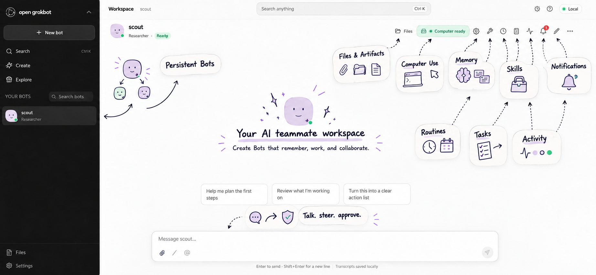

# Open-GrokBot

Open-GrokBot is an open-source workspace for creating AI teammates that persist beyond a single chat. Each Bot has a name, role, instructions, conversations, memory, tools, routines, and a place in your team.

Build a research assistant, coding partner, planner, reviewer, or an entire crew of specialized Bots—then keep their work, decisions, files, and context together in one local-first workspace.



*The Open-GrokBot workspace brings persistent Bots, computer use, files, memory, Skills, routines, tasks, and activity into one place.*

## Why Open-GrokBot

Most chat assistants disappear when the conversation ends. Open-GrokBot is built around durable teammates: Bots that retain their identity, continue their conversations, work with files and computer sessions, collaborate with other Bots, and keep their history available when you return.

It is designed as an open, hackable foundation for anyone who wants to experiment with persistent agents, local AI workflows, and multi-Bot collaboration.

## Features

### Persistent teammates

- Create any number of custom Bots with unique roles, instructions, avatars, and policies.
- Keep one-to-one conversations, message history, run status, and activity across restarts.
- Stream responses, steer work in progress, cancel runs, and recover interrupted work.

### Work that goes beyond chat

- Give Bots isolated Docker-backed computer sessions for browser, terminal, file, and code work.
- Upload source files, generate artifacts, and download results from the conversation.
- Review proposed actions, approve or deny consequential work, and take control of a Bot computer when needed.

### Memory, skills, and routines

- Save scoped memories with provenance and confidence.
- Create versioned Skills and enable them for the Bots that need them.
- Schedule Routines, inspect runs, receive notifications, and set usage budgets.

### Collaboration

- Create relationships between Bots, assign tasks, delegate work, and track results.
- Use temporary helpers for bounded subtasks without creating permanent roster entries.
- Organize group conversations with mentions, inboxes, and round limits.

### Extensible workspace

- Create reusable templates and browse a curated local marketplace.
- Connect integrations, receive webhook events, and search Bots, files, memories, skills, and routines.
- Export Bot data and manage lifecycle controls from the workspace.

## Requirements

- Docker Desktop with Docker Compose
- Node.js 22 and npm for frontend development
- Python 3.13 and [uv](https://docs.astral.sh/uv/) for backend development
- Optional: AWS credentials and Bedrock access for the live Kimi model provider

## Quick start

Copy the configuration template, then start the stack:

```bash
cp .env.example .env
docker compose up --build
```

On PowerShell, use:

```powershell
Copy-Item .env.example .env
docker compose up --build
```

Open [http://localhost:3000](http://localhost:3000). The API documentation is at [http://localhost:8000/docs](http://localhost:8000/docs), and Inngest is at [http://localhost:8288](http://localhost:8288).

The default runtime model provider is AWS Bedrock. Configure `BEDROCK_REGION`, `BEDROCK_MODEL_ID`, and AWS credentials in `.env`. For deterministic browser tests, use the Compose test override described below.

## Architecture

```text
Next.js client        Product workspace and live conversation UI
FastAPI server        APIs, product state, policies, and orchestration
PostgreSQL + pgvector Durable Bots, conversations, memory, and product records
Inngest               Durable jobs, routines, retries, and event-driven work
LangGraph             Resumable reasoning state for an individual Bot run
Docker computers      Replaceable local computer sessions and workspaces
```

Open-GrokBot keeps product data, background work, reasoning state, and computer sessions separate. A Bot is a durable product identity—not a process, model session, or container.

## Development and verification

Install backend dependencies:

```bash
cd server
uv sync --python 3.13
uv run ruff format --check app tests
uv run ruff check app tests
uv run mypy app computer_daemon
uv run pytest
```

Install frontend dependencies:

```bash
cd client
npm ci
npm run typecheck
npm run lint
npm run test
npm run build
```

Start the deterministic end-to-end stack and run Playwright:

```bash
docker compose -f docker-compose.yml -f docker-compose.test.yml up -d --build
cd client
npx playwright test
```

On macOS or Linux, `make test` runs the primary backend and frontend quality checks. See [server/README.md](server/README.md) and [client/README.md](client/README.md) for component-specific details.

## Repository layout

```text
client/             Next.js frontend
server/             FastAPI API, runtime, migrations, and tests
computer/sandbox/   Docker image for replaceable Bot computer sessions
docker-compose.yml  Local development stack
```

## Contributing

Contributions are welcome. If you are planning a large feature or architecture change, open an issue first so the direction can be discussed. Keep pull requests focused, include tests for behavior changes, and run the relevant checks above before opening a pull request.

## License

Open-GrokBot is available under the [MIT License](LICENSE).
